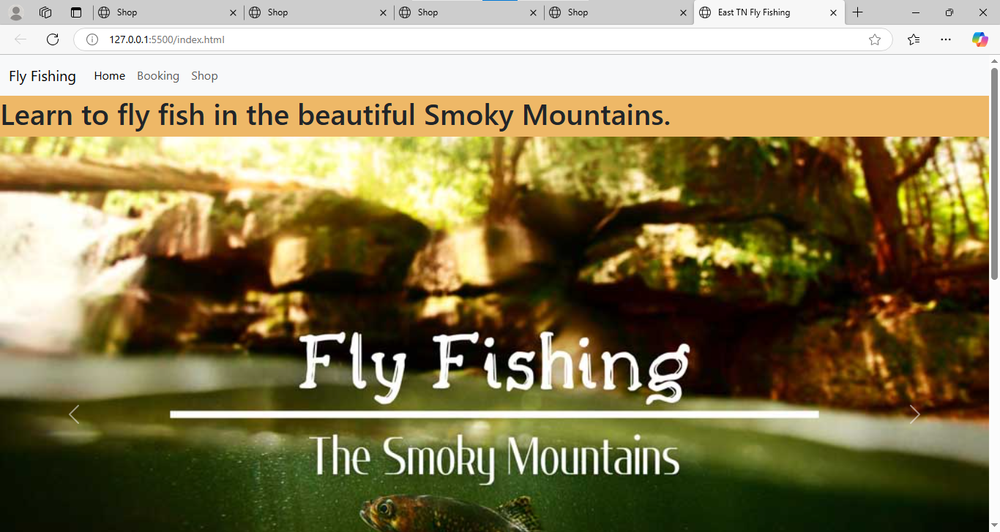
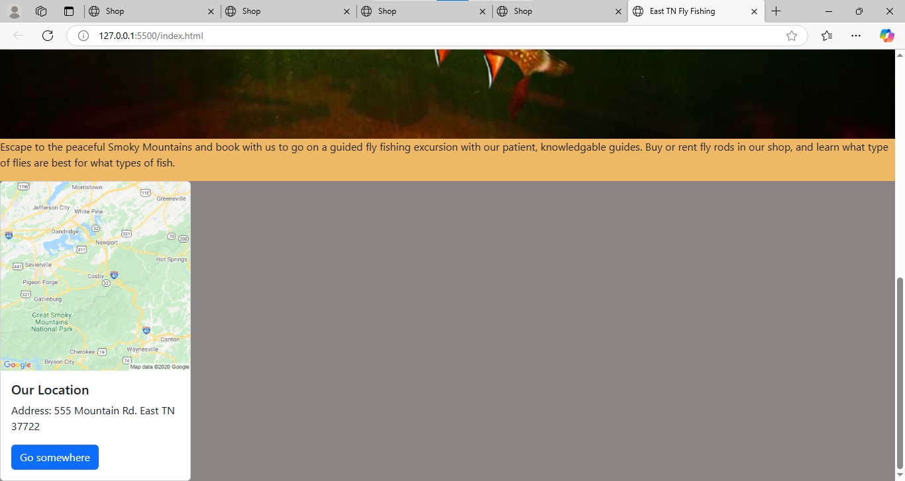
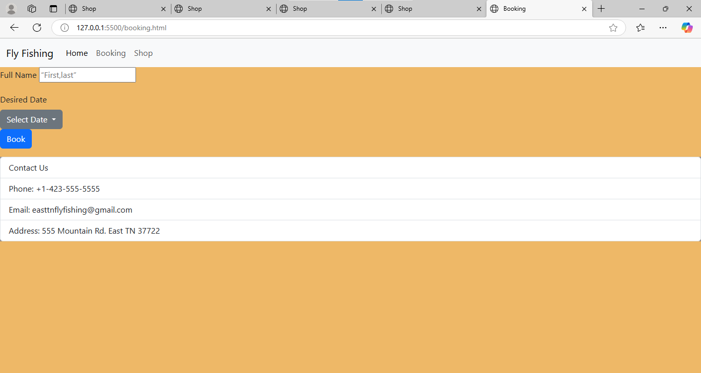
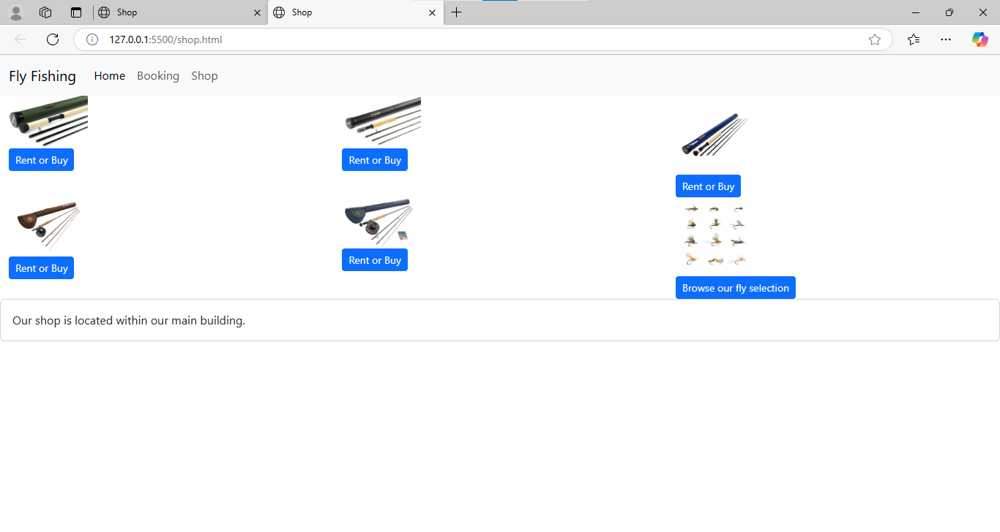
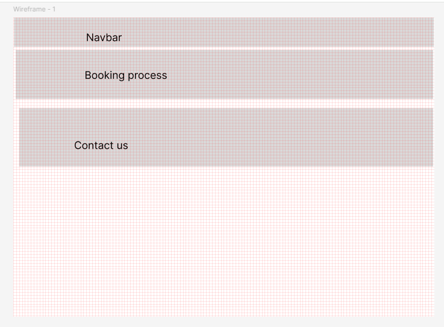
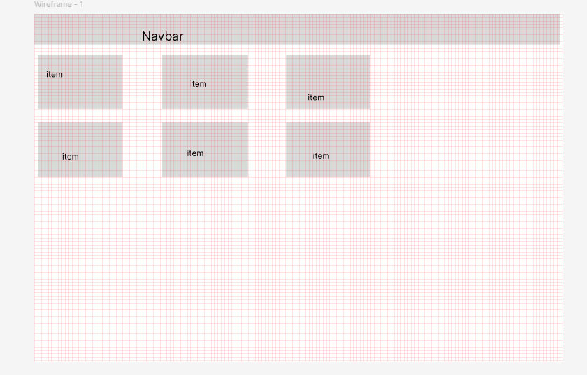

# Fly Fishing
# A site where you can book guided fishing tours where our guides will teach you how to fly fish and you can rent or buy fly rods and flies in our shop.
# 
 

# HTML, CSS, and Bootstrap
# Wire Frame:

# User Stories
As a first time fisherman, I want to find a place that offers lessons so I booked a guided tour

As an avid fly fisher, I was in need of a new fly rod and flies so I took a look into this sites shop and was able to accuire a new rod and numerous flies to add to my collection.

As a tourist from a big city, I was looking for a mountain activity so I booked a guided fishing tour with East Tn Fly Fishing and they gave me all the right tools and knowledge I needed to fly fish.
# Improvements
Styling, advanced features, more experience with coding.
# Author
 Erica Valentine